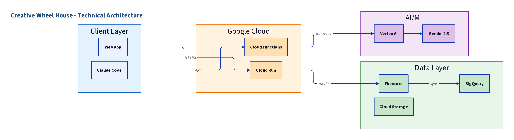
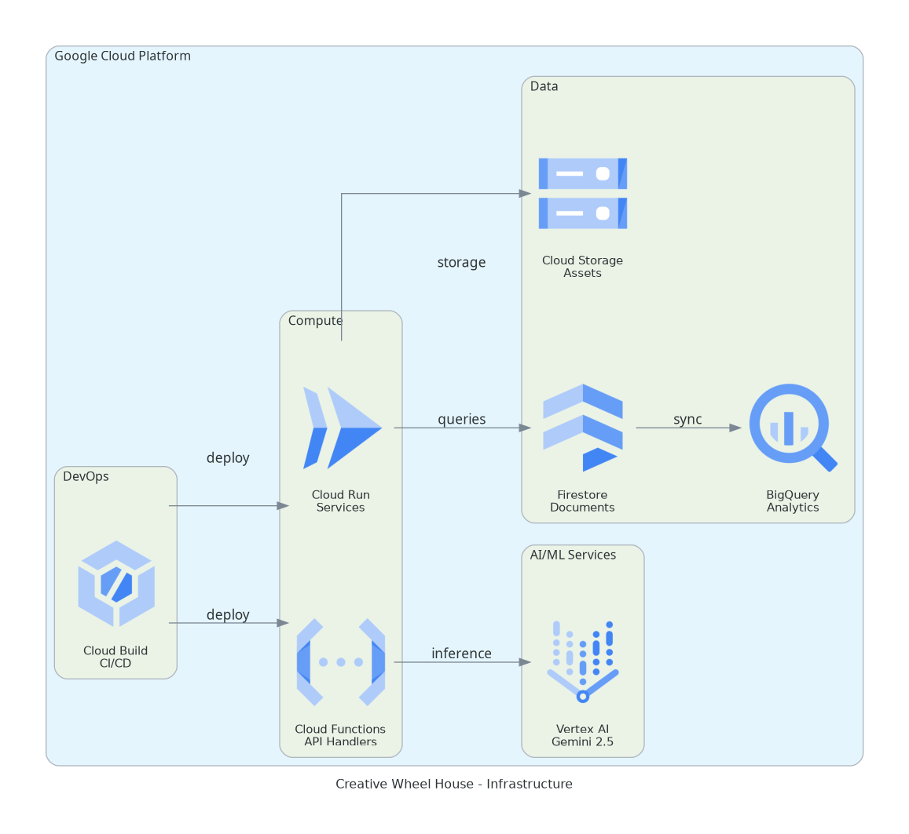
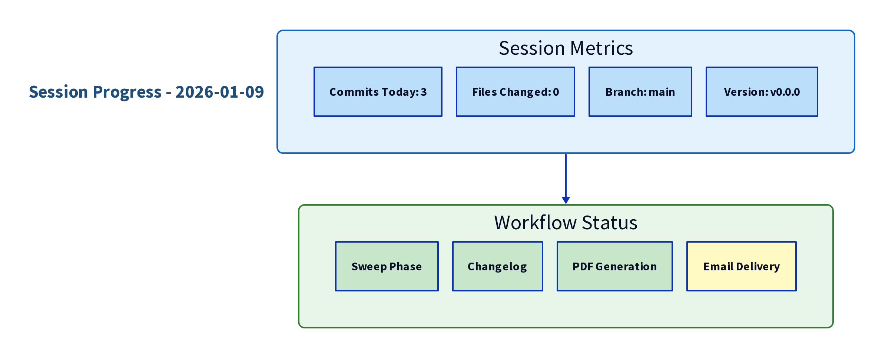
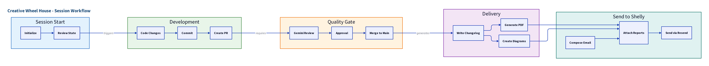

# Creative Wheel House - Visual Evolution

A chronological record of project architecture and workflow evolution.
Each session adds new diagrams showing the state at that point in time.

**How to read this document:**
- Most recent session at the top
- Scroll down to see project history
- Each diagram is self-explanatory with labels
- Use for quick visual scans of progress

* * *

## Session: Jan-09-2026

### Technical Architecture Overview
_System architecture showing client, compute, AI/ML, and data layers._

### GCP Infrastructure Architecture
_Production cloud infrastructure with Vertex AI, Cloud Run, and data services._

### Session Progress Metrics
_Current session statistics and workflow status._

### Session Workflow Pipeline
_End-to-session automation from code changes through delivery._

* * *
